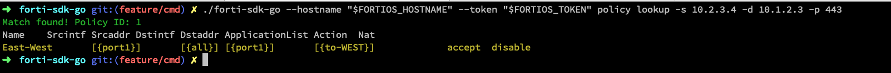

# forti-sdk-go

## Features

* FortiOS
* FortiManager
* FortiManager2


## `fortios` cli.
There's a CLI that's a work in progress. The main feature added thus far is ability to trace which firewall rule is being matched.

Be aware the cli is very much alpha-y. Error handling isn't great, and there are some annoying usage problems right now.

Here's some example usage. Follow directions [here](https://registry.terraform.io/providers/fortinetdev/fortios/latest/docs/guides/fgt_token) to get a token.

```bash
export FORTIOS_HOSTNAME=1.2.3.4:3333
export FORTIOS_TOKEN=foobartoken123
fortios --hostname "$FORTIOS_HOSTNAME" --token "$FORTIOS_TOKEN policy lookup -s 1.2.3.4 -d 1.2.3.4 -p 443" 
```


Items required for stable release

- [ ] Get fortios connection details from env vars.
- [ ] Handle Errors better.
